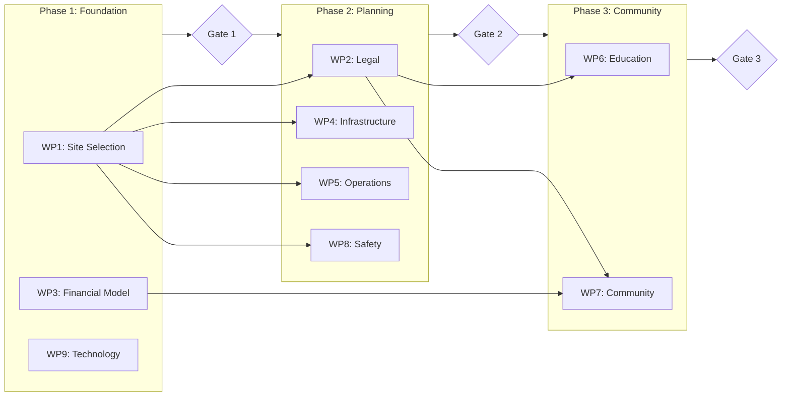

# 🌟 The Vision

> *"What if 20 families could spend a year living in the wilderness together, learning from nature, conducting citizen science, and building genuine community?"*

This project combines:
- **NASA mission structure** — Defined roles, redundancy, scientific purpose
- **Modern connectivity** — Starlink enables remote work from wilderness
- **Wilderness education philosophy** — Boyd Varty's tracking mindset, NOLS expedition leadership
- **Citizen science value** — Contributing real research while learning

**Target Parameters:**
| Metric | Value |
|--------|-------|
| Families | 20 |
| Total People | ~80 |
| Duration | 365 days |
| Budget | €1.2M - €1.7M |
| Per Person | €15,000 - €21,000 |
---

# Project Tracker

**Multi-Agent AI Planning System for Year-Long Wilderness Family Expedition**

[](https://claude.ai)
[](LICENSE)
[]()
[]()

---

## 🎯 What is Project Tracker?

Project Tracker is an **autonomous multi-agent AI system** designed to plan, research, and coordinate a year-long wilderness expedition for 20 families (~80 people). It combines:

- **10 specialized AI agents** that conduct deep background research
- **10 integrated work packages** covering all aspects of expedition planning
- **6 reusable research skills** for consistent, high-quality outputs
- **Structured briefings and decision packages** for human leadership

Built for use with **Claude Code** and **Claude Cowork**, this system demonstrates how AI agents can work in parallel to tackle complex, multi-domain planning challenges.


## 🏗️ System Architecture

```
┌─────────────────────────────────────────────────────────────────────┐
│                      PROJECT TRACKER SYSTEM                         │
├─────────────────────────────────────────────────────────────────────┤
│                                                                     │
│  ┌─────────────────────────────────────────────────────────────┐    │
│  │                 HUMAN LEADERSHIP TEAM                       │    │
│  │                                                             │    │
│  │   Mission     GIS       Legal     Finance    Infrastructure │    │
│  │   Commander   Lead      Lead      Lead       Engineer       │    │
│  │      ▲         ▲         ▲          ▲           ▲           │    │
│  │      │         │         │          │           │           │    │
│  │   Operations Education Community  Safety      Tech          │    │
│  │   Lead       Director  Lead       Officer     Lead          │    │
│  └──────┼─────────┼─────────┼──────────┼───────────┼───────────┘    │
│         │         │         │          │           │                │
│  ┌──────┴─────────┴─────────┴──────────┴───────────┴───────────┐    │
│  │                     AI AGENT LAYER                          │    │
│  │                                                             │    │
│  │  mission-control │ gis-scout │ legal-navigator │ finance-   │    │
│  │  infrastructure- │ logistics-│ education-      │ community- │    │
│  │  safety-officer  │ tech-ops  │                 │            │    │
│  └─────────────────────────────────────────────────────────────┘    │
│                              │                                      │
│  ┌───────────────────────────┴──────────────────────────────────┐   │
│  │                     RESEARCH TOOLS                           │   │
│  │  Web Search │ Perplexity Deep Research │ Multi-Tier Research │   │
│  └──────────────────────────────────────────────────────────────┘   │
│                                                                     │
└─────────────────────────────────────────────────────────────────────┘
```

---

## 👥 The 10 Human Roles + AI Agents

Each human role has a dedicated AI agent that conducts autonomous research and prepares briefings:

| Human Role | AI Agent | Primary Focus |
|------------|----------|---------------|
| Mission Commander | `mission-control` | Coordination, synthesis, stakeholder management |
| GIS & Site Selection Lead | `gis-scout` | Location research, terrain analysis, climate |
| Legal & Governmental Lead | `legal-navigator` | Permits, regulations, liability, entity structure |
| Finance Lead | `finance-analyst` | Budget modeling, funding, pricing strategy |
| Infrastructure Engineer | `infrastructure-engineer` | Water, sanitation, shelter, power systems |
| Operations Lead | `logistics-planner` | Supply chain, transport, resupply operations |
| Education Director | `education-curator` | Curriculum, citizen science, partnerships |
| Community Lead | `community-builder` | Family selection, governance, culture |
| Safety Officer | `safety-officer` | Risk assessment, emergency protocols, medical |
| Tech Lead | `tech-ops` | Connectivity, communications, data systems |

---

## 📦 Work Packages

The project is organized into 10 integrated work packages:



| WP | Name | Duration | Key Deliverable |
|----|------|----------|-----------------|
| WP1 | Site Selection & GIS | 12 weeks | Location recommendation |
| WP2 | Legal & Regulatory | 16 weeks | Permit pathway |
| WP3 | Financial Model | 12 weeks | Budget & funding plan |
| WP4 | Infrastructure Design | 14 weeks | System specifications |
| WP5 | Operations & Logistics | 14 weeks | Supply chain plan |
| WP6 | Education & Science | 16 weeks | Curriculum & partnerships |
| WP7 | Community Design | 14 weeks | Governance & selection |
| WP8 | Safety & Medical | 12 weeks | Risk assessment & protocols |
| WP9 | Technology & Comms | 10 weeks | Connectivity plan |
| WP10 | Integration | Ongoing | Project coordination |

---

## 📁 Repository Structure

```
wilderness-expedition-project/
├── CLAUDE.md                    # Master configuration for Claude Code/Cowork
├── README.md                    # This file
│
├── agents/                      # 10 AI agent definitions
│   ├── mission-control.md
│   ├── gis-scout.md
│   ├── legal-navigator.md
│   ├── finance-analyst.md
│   ├── infrastructure-engineer.md
│   ├── logistics-planner.md
│   ├── education-curator.md
│   ├── community-builder.md
│   ├── safety-officer.md
│   └── tech-ops.md
│
├── skills/                      # Reusable research skill guides
│   ├── deep-research/SKILL.md
│   ├── gis-analysis/SKILL.md
│   ├── regulatory-search/SKILL.md
│   ├── budget-modeling/SKILL.md
│   ├── supplier-research/SKILL.md
│   └── stakeholder-mapping/SKILL.md
│
├── work-packages/               # Work package specifications
│   ├── WP-OVERVIEW.md          # Master summary & timeline
│   ├── WP1-site-selection.md   # Full specification
│   └── WP2-10-specifications.md
│
├── outputs/                     # Agent outputs & deliverables
│   ├── PITCH-DECK.md           # Executive presentation
│   ├── project-tracker-dashboard.jsx  # Interactive React dashboard
│   ├── diagrams/               # Mermaid architecture diagrams
│   ├── briefings/              # Synthesized briefings
│   ├── research/               # Deep research outputs
│   ├── reports/                # Formal reports
│   ├── maps/                   # GIS outputs
│   ├── alerts/                 # Time-sensitive findings
│   └── decisions/              # Decision packages
│
├── data/                        # Reference databases
│   ├── contacts/               # Stakeholder database
│   ├── suppliers/              # Vendor database
│   └── regulations/            # Legal research
│
└── research-queue/              # Pending research tasks
```

---

## 🚀 Getting Started

### With Claude Code

1. Clone this repository
2. Open the folder in Claude Code
3. The `CLAUDE.md` file will be automatically loaded as context
4. Invoke agents with natural language:

```
@gis-scout: Research wilderness areas in Norway suitable for 
year-long family camping with 80 people. Include permit requirements.
```

### With Claude Cowork

1. Clone this repository
2. Load `CLAUDE.md` as your project configuration
3. Reference agent files when assigning tasks
4. Use skills for specialized research workflows

### Agent Activation Examples

```bash
# Start site selection research
@gis-scout: Execute initial location scan for Tier 1 regions

# Research legal requirements
@legal-navigator: What permits are needed for extended wilderness 
camping in Scotland?

# Get budget analysis
@finance-analyst: Build cost comparison for yurt vs wall tent shelters

# Run cross-validated research
@mission-control: Use multi-tier research to investigate wilderness 
education insurance options
```

---

## 🔧 Research Tools

The agents use multiple research tools at different depth levels:

| Level | Tool | Speed | Use Case |
|-------|------|-------|----------|
| Quick | `web_search` | Seconds | Facts, current info |
| Moderate | `perplexity_ask` | 10-30 sec | Conversational research |
| Deep | `perplexity_research` | 5-15 min | Comprehensive single-source |
| Cross-Validated | `multi-tier-research` | 10-30 min | High-stakes decisions |

The `multi-tier-research` skill orchestrates Perplexity, OpenAI, and Gemini research APIs with secure credential management.

---

## 📊 Interactive Dashboard

The repository includes a React-based interactive dashboard (`outputs/project-tracker-dashboard.jsx`) that visualizes:

- System architecture
- Work package timeline
- Dependencies and phases
- Budget breakdown

---

## 🎯 Key Milestones

| Gate | Week | Decision |
|------|------|----------|
| **Site Selection** | 12 | Approve top 3 locations |
| **Design Complete** | 20 | Confirm all systems designed |
| **Launch Ready** | 24 | Go/No-Go for family recruitment |
| **Family Selection** | 36 | 20 families committed |
| **Expedition Launch** | 48 | Expedition begins |

---

## 🤝 Contributing

This is an experimental multi-agent planning system. Contributions welcome:

- **Agent improvements** — Enhanced research strategies, better prompts
- **New skills** — Additional specialized research capabilities
- **Work package refinements** — More detailed specifications
- **Documentation** — Guides, tutorials, examples

---

## 📜 License

MIT License — See [LICENSE](LICENSE) for details.

---

## 🙏 Acknowledgments

Inspired by:
- **Boyd Varty** — *The Lion Tracker's Guide to Life*, Londolozi wilderness immersion
- **NOLS** — 60 years of wilderness expedition leadership
- **Teaching Drum Outdoor School** — Year-long wilderness guide program
- **NASA Mission Operations** — Role structure and redundancy principles

---

## 📬 Contact

This project is part of an exploration into AI-assisted expedition planning. 

For questions about the system architecture or agent design, please open an issue.

---

<div align="center">

**Project Tracker** — *Where mission planning meets wilderness dreams*

🌲 🏕️ 🌲

</div>
